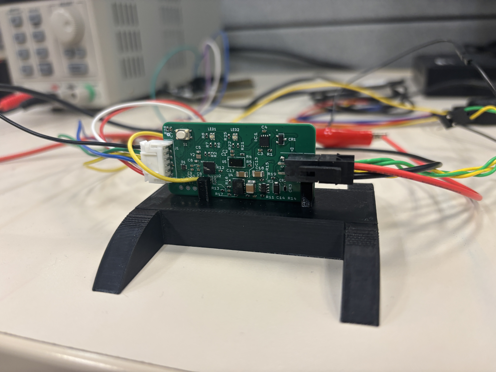
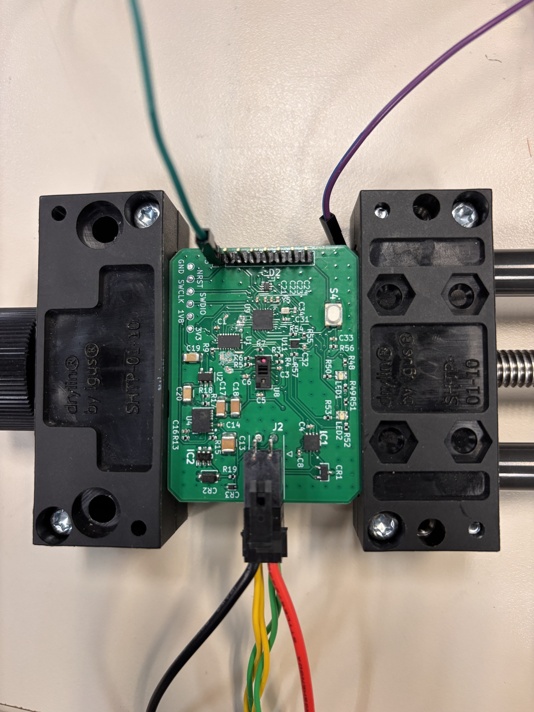
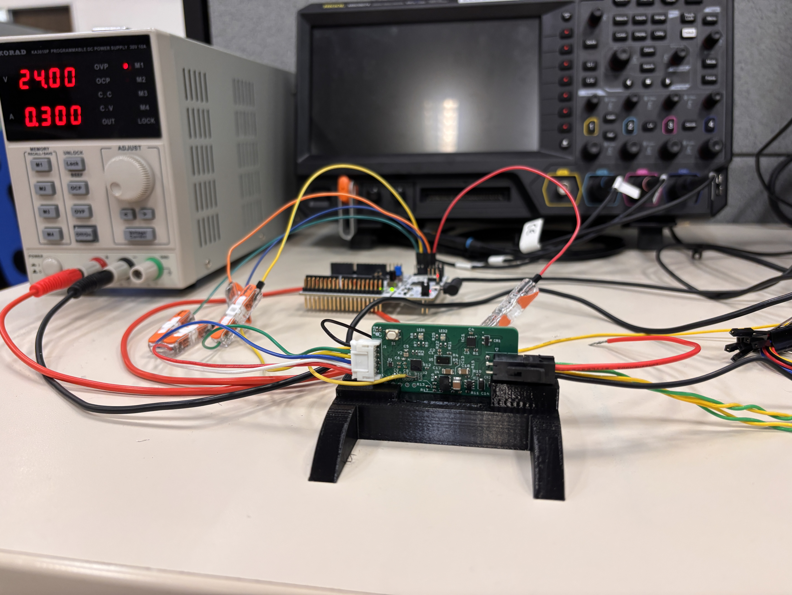
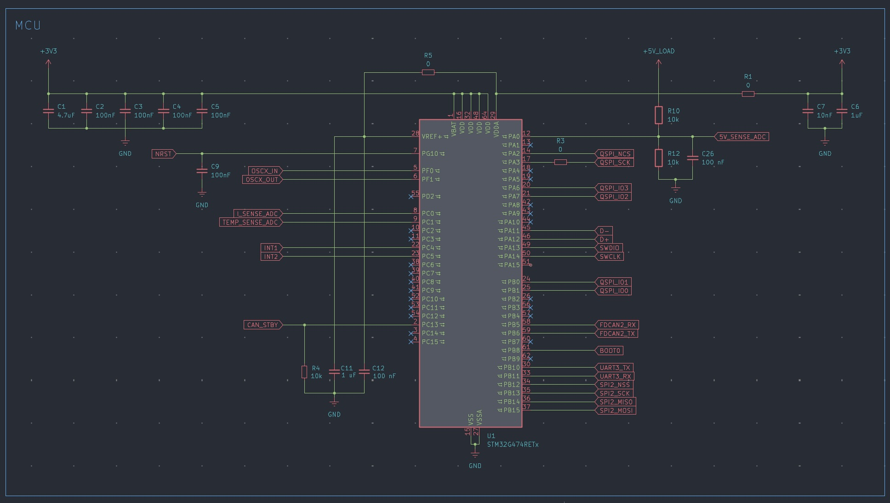
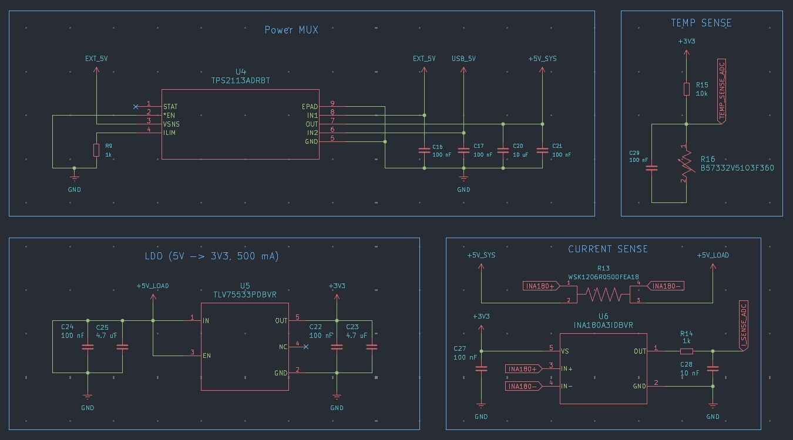
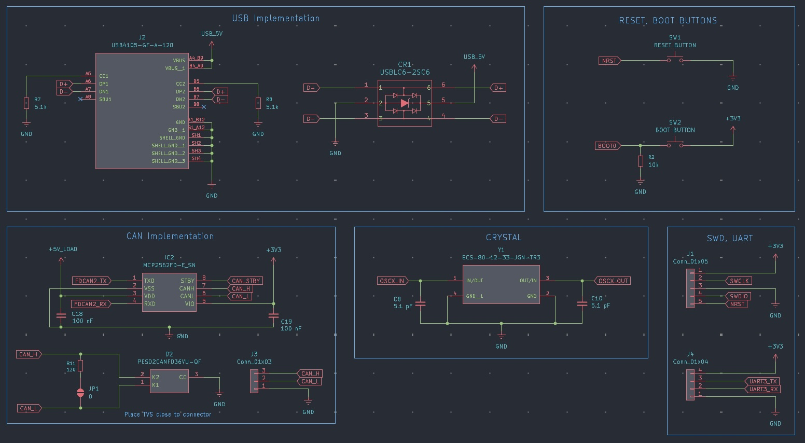
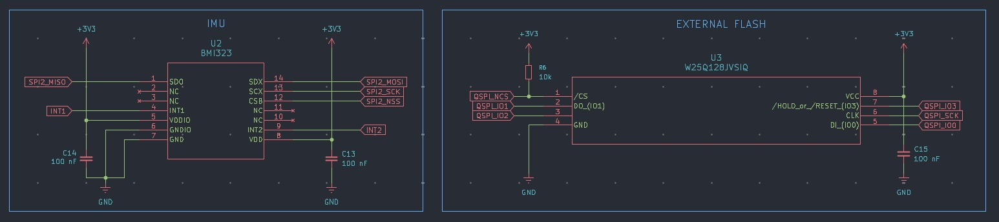

# PCB Design Showcase
### Rahul Kishore | Electrical & Computer Engineering, Rice University

Hi! I'm Rahul, a junior studying Electrical and Computer Engineering at Rice University.

I'm particularly interested in embedded systems, PCB design, and hardware-software integration. What I enjoy most about electrical engineering is taking an idea from its initial schematic through PCB layout, fabrication, bring-up, and debugging, and eventually seeing it work as a physical system.

Below are two projects I've particularly enjoyed working on:

1. **LiDAR Hardware Development at REV Robotics** — Fabricated PCB prototypes, hardware bring-up, and a miniaturized stacked-board design.
2. **STM32G4 Flight Controller** — An independent project focused on embedded hardware architecture, power management, sensor integration, and communication interfaces.

---

## 1. LiDAR Hardware Development | REV Robotics

**Hardware Engineering Intern | May–August 2026**

During my internship at REV Robotics, I designed and tested custom PCBs integrating LiDAR sensors with STM32 microcontrollers for competitive robotics applications.

I developed two prototype PCB designs using different LiDAR sensors, including a six-layer board integrating an STM32 microcontroller, sensor interfaces, power circuitry, and supporting electronics.

My work involved component selection, schematic design, PCB layout, embedded firmware development, and hardware bring-up.

### Fabricated PCB Prototypes

*One of the fabricated LiDAR interface PCB prototypes.*

*An alternative LiDAR interface design using a different sensor.*

### Electrical Design: 1.8 V to 3.3 V Logic Translation

One interesting electrical challenge involved interfacing a LiDAR sensor operating at **1.8 V logic levels** with an STM32 microcontroller operating at **3.3 V**.

Directly interfacing devices with incompatible logic levels can cause communication issues or expose components to voltages outside their specifications.

To address this, I incorporated logic-level translation circuitry, allowing the sensor and MCU to communicate while operating at their respective voltage levels.

This reinforced the importance of understanding component-level electrical requirements rather than simply connecting corresponding communication pins.

### Hardware Bring-Up and Debugging

*Hardware bring-up and testing using laboratory power and measurement equipment.*

After receiving the fabricated boards, I performed initial hardware bring-up and validation.

This involved verifying power rails, testing communication interfaces, and investigating power, timing, and signal-integrity issues using oscilloscopes and multimeters.

I also developed embedded C/C++ firmware for STM32-based LiDAR data acquisition over I2C and UART.

One aspect I particularly enjoyed was developing a Web Serial API interface to visualize UART telemetry directly on a computer. I used AI-assisted development to accelerate portions of the firmware and visualization work, while testing the resulting functionality against the actual hardware.

### Hardware Demonstration

The following video demonstrates the LiDAR system and its telemetry visualization interface.

https://github.com/user-attachments/assets/29361047-5b0f-40eb-8212-83bb15a60f95

---

## 2. Featured Design: Miniaturized Stacked-PCB Architecture

One of my favorite engineering challenges came toward the end of my internship, when I worked on miniaturizing a LiDAR system into a footprint smaller than **1 × 1 inch**.

The challenge wasn't simply reducing the board dimensions.

The LiDAR sensor needed to sit at a particular elevation so its optical sensing element could reach the edge of the enclosure.

This created an interesting mechanical constraint: the electronics needed to fit into a small footprint while maintaining the sensor's required position.

### The Solution

Rather than placing everything onto a single PCB, I designed a **two-board stacked architecture**.

The boards were electrically connected using 16 mating male/female header connections arranged in two adjacent groups of eight, with a spacer separating the PCB levels.

This allowed the sensor to be elevated relative to the supporting electronics while maintaining a compact overall footprint.

An important part of the design involved ensuring that the mating headers were correctly aligned across both boards while accounting for component placement, mechanical clearances, and the sensor's position within the enclosure.

### Why I'm Proud of This Design

What I particularly enjoyed about this solution was that it wasn't exclusively an electrical or mechanical design problem.

Instead of treating the PCB as something that simply needed to fit inside an enclosure, I used the arrangement of the PCBs themselves to solve a mechanical packaging constraint.

It was a relatively simple concept, but it required considering electrical connectivity, connector alignment, board geometry, and sensor positioning together.

I find that intersection of electrical and mechanical engineering especially satisfying because it requires thinking about the entire physical system rather than just an individual circuit.

**Development Status:** I completed this design near the end of my internship but left before the fabricated revision arrived. As a result, I wasn't able to participate in its physical bring-up or validation.

*The photographs in the previous section show earlier fabricated prototypes, not this stacked-board revision.*

---

## 3. STM32G4 Flight Controller | Personal Project

**August 2026–Present | KiCad, STM32, C/C++**

I've also been independently designing a flight controller based on the **STM32G474 microcontroller**.

I started this project because I wanted to deepen my understanding of embedded hardware development and challenge myself to design a complete embedded system from the ground up.

The controller incorporates motion sensing, external flash memory, CAN-FD communication, USB-C connectivity, debugging interfaces, and onboard power monitoring.

### MCU Architecture

*STM32G474 microcontroller and supporting circuitry.*

I selected the STM32G4 family because of its combination of computational performance, peripheral capabilities, and suitability for real-time embedded control applications.

I wanted a microcontroller that would allow me to explore sensor acquisition, peripheral communication, and real-time firmware development while providing enough flexibility to expand the system.

### Power Architecture and Monitoring

*Power-source selection, regulation, and monitoring circuitry.*

One aspect of this design I've particularly enjoyed is developing the power architecture.

Rather than simply supplying power to the MCU and peripherals, I wanted to design a system capable of monitoring its own electrical behavior.

The schematic incorporates:

- **TPS2113A power multiplexer** for selecting between USB and external 5 V supplies.
- **3.3 V linear regulator** for the microcontroller and supporting electronics.
- **INA180 current-sense amplifier** with a shunt resistor.
- **ADC-based supply-voltage monitoring.**
- **Temperature sensing.**

My goal is to eventually allow the firmware to monitor voltage and current consumption during operation, potentially helping identify abnormal loading conditions or electrical faults.

### Communication and Debugging Interfaces

*USB-C, CAN-FD, clock, and debugging circuitry.*

The controller includes circuitry for CAN-FD communication using an external transceiver, along with ESD protection and jumper-selectable 120-ohm bus termination.

I chose to make CAN termination configurable so the controller could potentially operate at different locations on a CAN bus without requiring a board modification.

The design also includes:

- USB-C connectivity with ESD protection.
- External SWD debugging.
- UART communication.
- Boot and reset circuitry.
- External clock circuitry.

A major goal was to make the controller straightforward to program, test, and debug without requiring a dedicated onboard debugger.

### Sensor Integration and External Storage

*BMI323 IMU and external QSPI flash circuitry.*

The controller incorporates a **BMI323 inertial measurement unit** communicating through SPI, with dedicated interrupt outputs.

I also selected a **W25Q128 external QSPI flash device** to provide additional nonvolatile storage for potential telemetry and flight-data logging.

These components are part of my longer-term goal of developing a controller capable of acquiring, processing, and recording flight sensor data.

### Current Development Status

The flight controller is currently in schematic development, with PCB layout, fabrication, and physical validation still pending.

This project has been especially valuable because it has required me to research components, interpret datasheets, evaluate electrical interfaces, and make system-level design decisions independently.

---

## What I Enjoy About Hardware Engineering

What draws me to PCB design is how it combines so many aspects of engineering.

Circuit theory and electromagnetics explain how a design should behave, but component selection, layout, signal integrity, mechanical constraints, and manufacturing determine how well it works in practice.

My experience at REV Robotics gave me an appreciation for the debugging and iteration involved in developing physical hardware. My flight controller has allowed me to explore more of the architecture and design process independently.

I especially enjoy engineering problems where the most interesting solution comes from considering the entire system, rather than optimizing a single component or circuit.

---

### Contact

**Rahul Kishore**

Electrical & Computer Engineering | Rice University

[GitHub](https://github.com/LegendLuhar) |
[LinkedIn](https://linkedin.com/in/rahul-kishore06)
